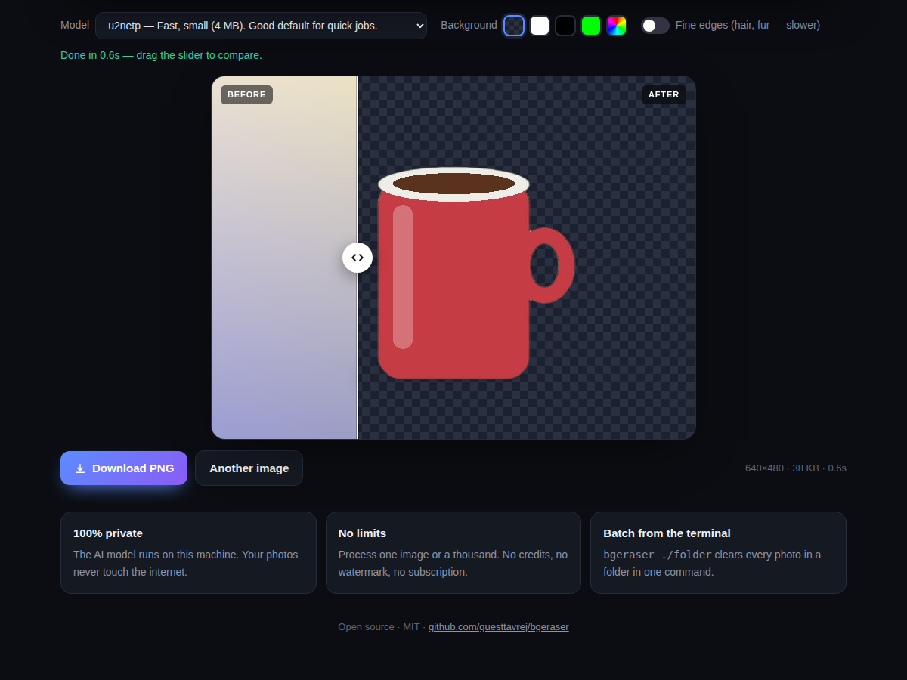
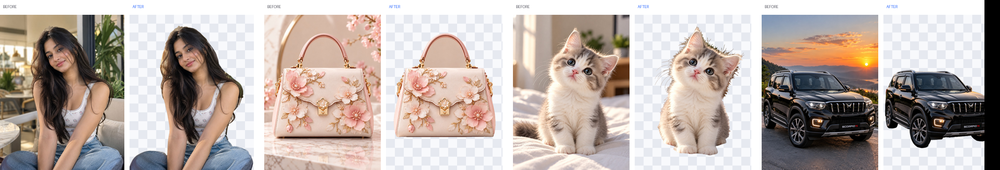

<div align="center">

# bgeraser

**Remove image backgrounds in one click — free, offline, unlimited.**

A free alternative to remove.bg that runs on your own computer.
No uploads. No watermark. No sign-up. No per-image fees.

[](https://pypi.org/project/bgeraser/)
[](https://pypi.org/project/bgeraser/)
[](LICENSE)
[](https://github.com/guesttavrej/bgeraser/actions)



**Real results, straight out of bgeraser:**



</div>

---

## Why bgeraser?

Online background removers make you upload your photos to their servers, add watermarks, limit you to a few free images, or charge per download. remove.bg's website is shutting down on 1 December 2026.

bgeraser does the same job **on your own computer**:

| | Online tools | bgeraser |
|---|---|---|
| Price | Free trial, then pay per image | **Free, forever** |
| Watermark | Often on free tier | **Never** |
| Limits | 1–50 images/month free | **Unlimited** |
| Privacy | Your photos go to their server | **Nothing leaves your PC** |
| Batch | Paid feature | **One command for a whole folder** |
| Works offline | No | **Yes** (after first setup) |

## Get started in 3 steps

You need Python 3.9 or newer. Don't have it? Get it from [python.org/downloads](https://www.python.org/downloads/) and tick **"Add Python to PATH"** during install.

**Step 1 — Install** (open Command Prompt / Terminal and run):

```bash
pip install "bgeraser[web]"
```

**Step 2 — Start the app:**

```bash
bgeraser serve
```

The first run downloads the AI model (about 170 MB, one time). Wait for `model ready`.

**Step 3 — Open your browser** at **http://127.0.0.1:5000**

Drop a photo, paste one with Ctrl+V, or click a sample. Drag the slider to compare, pick a background, download the PNG. Done.

> Keep the Command Prompt window open while you use the app. Press Ctrl+C in it to stop.

## What you can do

- **Transparent PNG** — the default, ready for design work
- **Solid background** — white, black, green screen, or any color you pick (product listings, ID photos, thumbnails)
- **Before / after slider** — check the result before you download
- **Fine edges mode** — extra care for hair and fur
- **Mask export** — `--mask` saves a grayscale layer mask so you can fix a cut-out by hand in GIMP, Photoshop or Krita. The PNG keeps every original pixel under the transparency, so nothing is ever lost.
- **Batch a whole folder** — one command, hundreds of images
- **Use it from Python** — a two-line API for your own scripts

## Command line

```bash
bgeraser photo.jpg                       # → photo-nobg.png next to the original
bgeraser photo.jpg -o clean.png          # choose the output name
bgeraser photo.jpg --bg white            # solid background instead of transparent
bgeraser photo.jpg --bg "#00ff00"        # any hex color
bgeraser ./products                      # every image in a folder → ./products/nobg/
bgeraser ./products -o ./out --recursive # include sub-folders
bgeraser photo.jpg --mask                # also save photo-mask.png (layer mask for GIMP / Photoshop)
bgeraser photo.jpg --matting             # finer edges for hair / fur (slower)
bgeraser --model u2netp ./products       # fastest model for big batches
bgeraser models                          # list available models
bgeraser serve --port 8080               # web app on another port
```

## Python

```python
from bgeraser import remove_background, remove_background_bytes, process_folder, get_mask

remove_background("photo.jpg")                                  # → photo-nobg.png
remove_background("photo.jpg", "out.png", bg_color="white")     # flatten onto white
png_bytes = remove_background_bytes(open("photo.jpg", "rb").read())
process_folder("./products", "./products/out")                  # batch
mask = get_mask(Image.open("photo.jpg"))                        # grayscale mask (PIL "L")
```

## How it works

1. An open-source segmentation model ([ISNet](https://github.com/xuebinqin/DIS) / [U²-Net](https://github.com/xuebinqin/U-2-Net), via [rembg](https://github.com/danielgatis/rembg)) finds the subject.
2. bgeraser cleans the mask: the subject is made fully solid (no see-through arms or legs), stray fragments are removed, holes are filled, and the outline keeps a soft, natural edge.
3. The result is saved as a PNG with transparency, or flattened onto the color you chose.

Everything runs locally on the CPU. A typical photo takes 1–3 seconds.

## Models

| Model | Best for | Size |
|---|---|---|
| `isnet-general-use` *(default)* | Cleanest edges — people, products, animals, cars | 170 MB |
| `u2net` | General purpose | 170 MB |
| `u2netp` | Fastest, for big batches | 4 MB |
| `u2net_human_seg` | Portraits | 170 MB |
| `isnet-anime` | Anime and illustrations | 170 MB |
| `u2net_cloth_seg` | Clothing segmentation | 170 MB |
| `silueta` | u2net quality, smaller | 43 MB |

Pick one with `--model NAME` or from the dropdown in the web app. Models download the first time you use them.

## Tips for the best result

- Works best on photos with **one clear subject** — a person, product, pet, car or logo.
- Anything the subject is **resting on** (a table, a blanket) may be kept, because the AI treats it as part of the subject. Shoot on a plain floor or backdrop for a fully clean cut-out.
- Hair, fur and glass are the hardest cases. Try **Fine edges** (or `--matting`) on those.
- Results look "damaged"? Make sure you're on the default model, not `u2netp`.

## FAQ

**Is it really free?** Yes. MIT licensed, no accounts, no limits.

**Does it upload my photos anywhere?** No. The model runs on your machine. You can unplug the internet after the first setup.

**Does it need a GPU?** No. It runs on any normal laptop CPU.

**Windows / Mac / Linux?** All three, anywhere Python runs.

**Can I use it from my phone?** Run `bgeraser serve --host 0.0.0.0` on your PC, then open `http://<your PC's IP>:5000` from a phone on the same Wi-Fi.

## Contributing

Issues and pull requests are welcome. To work on it:

```bash
git clone https://github.com/guesttavrej/bgeraser
cd bgeraser
pip install -e ".[dev]"
pytest
```

## License

MIT © Tavrej / Yonzon Studio. Built on [rembg](https://github.com/danielgatis/rembg), [ISNet](https://github.com/xuebinqin/DIS) and [U²-Net](https://github.com/xuebinqin/U-2-Net).
